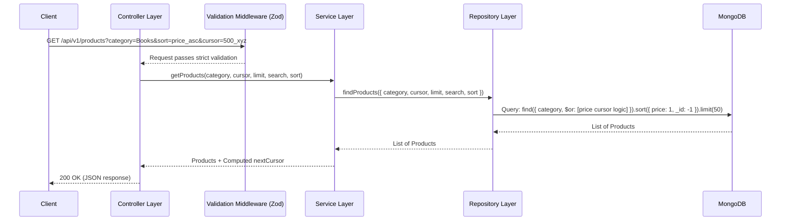

# CodeVector Full Stack Assessment

This repository contains a full-stack application designed to serve and browse an extensive catalog of 200,000 products. The focus of this application is on extreme performance, robust architecture, and a highly aesthetic user interface.

## 1. System Interaction Diagram

The sequence diagram below maps out how a client request flows through our meticulously segregated backend layers.



## 2. Application Programming Interfaces (APIs)

The backend provides a RESTful API returning structured JSON.

### A. Fetch Products
Retrieves a paginated list of products.

**Endpoint:** `GET /api/v1/products`

**Query Parameters:**
- `category` (optional): Filter products by category (e.g., "Electronics").
- `search` (optional): Execute a partial regex search against product names.
- `sort` (optional): Sort the results. Accepted values: `newest`, `price_asc`, `price_desc`.
- `limit` (optional): The number of items to return (default: 50).
- `cursor` (optional): The cursor string provided from the previous request to fetch the next page.

**Example Request:**
```http
GET http://localhost:5000/api/v1/products?limit=2&sort=price_asc
```

**Example Response:**
```json
{
  "status": "success",
  "data": {
    "products": [
      {
        "_id": "648f5e7f9a1b2c3d4e5f6g7h",
        "name": "Product 1a2b3c4d",
        "category": "Electronics",
        "price": 12.99,
        "unique_id": "123e4567-e89b-12d3-a456-426614174000",
        "created_at": "2023-06-18T10:00:00.000Z",
        "updated_at": "2023-06-18T10:00:00.000Z",
        "__v": 0
      },
      {
        "_id": "648f5e7f9a1b2c3d4e5f6g7i",
        "name": "Product 5e6f7g8h",
        "category": "Home",
        "price": 14.50,
        "unique_id": "987e6543-e21b-12d3-a456-426614174111",
        "created_at": "2023-06-18T10:05:00.000Z",
        "updated_at": "2023-06-18T10:05:00.000Z",
        "__v": 0
      }
    ],
    "nextCursor": "14.5_648f5e7f9a1b2c3d4e5f6g7i"
  }
}
```

### B. Fetch Categories
Retrieves all dynamically available categories.

**Endpoint:** `GET /api/v1/categories`

**Example Request:**
```http
GET http://localhost:5000/api/v1/categories
```

**Example Response:**
```json
{
  "status": "success",
  "data": {
    "categories": [
      "Electronics",
      "Books",
      "Clothing",
      "Home"
    ]
  }
}
```

## 3. Codebase Structure and Layer Segregation

The project is split into a `frontend` and a `backend`, adhering to strict separation of concerns.

### Backend Architecture (`/backend`)

We employ a layered architecture to ensure that the code is maintainable, highly scalable, and modular.

```text
backend/
├── scripts/
│   └── seed.js                 # Wipes DB and seeds 200,000 records
└── src/
    ├── app.js                  # Express app & global middlewares
    ├── server.js               # Application entry point & port listener
    ├── config/                 # Environment variables and DB connection
    ├── controllers/            # HTTP layer (request/response handling)
    ├── models/                 # Mongoose schemas and database indexes
    ├── repositories/           # Database access layer (Mongoose queries)
    ├── routes/                 # Hierarchical URL mapping (e.g. /v1/)
    ├── services/               # Core business logic and cursor math
    ├── utils/                  # Reusable utilities (e.g. AppError)
    └── validation/             # Zod schemas and validation middleware
```

- **Routes:** Maps incoming URL paths to specific controllers. Organized hierarchically (e.g., `index.js` -> `v1/index.js` -> `product.routes.js`) for versioning support.
- **Validation:** Houses the Zod schemas and a universal middleware. This layer guarantees that controllers only ever receive sanitized, strictly typed parameters.
- **Controllers:** The HTTP layer. Controllers parse the validated requests and format the outgoing JSON responses. They contain zero business logic.
- **Services:** The heart of the application. Services manage business rules, such as calculating complex compound cursors for pagination based on the selected sorting method.
- **Repositories:** The data access layer. Repositories abstract the database. This is the only place where Mongoose queries (e.g., `$regex`, `$lt`, `$or`) and `.lean()` optimizations are written.
- **Models:** Defines the data structure using Mongoose. Crucially, this layer also defines the performance indexes (`text` indexes, compound indexes for sorting).

### Frontend Architecture (`/frontend`)

Built with Vite and React.

```text
frontend/
└── src/
    ├── App.jsx                 # Main layout, State Management, API integration
    ├── App.css                 # Component-specific styles
    ├── index.css               # Global CSS variables and glassmorphism resets
    └── main.jsx                # React DOM render entry point
```

- **`src/App.jsx`:** The main layout integrating state management for debounced searches, category selection, and infinite cursor pagination.
- **`src/index.css` & `src/App.css`:** Vanilla CSS establishing a premium, monochrome glassmorphic design system featuring blur effects and smooth micro-animations.

## 4. How It Works: Technical Highlights

### Cursor-Based Pagination
Offset pagination (`.skip()`) becomes exponentially slower as the database grows and leads to missing or duplicated data if records are inserted concurrently. We solve this by using the intrinsic timestamp inside MongoDB's `_id` field.
When sorting by price, we construct a compound cursor (e.g., `price_id`) and utilize a `$or` query to fetch records perfectly, handling ties in price by falling back to the `_id` chronologically. This guarantees perfect `O(1)` performance and total consistency.

### Partial Regex Search
Instead of strict `$text` indexing which doesn't allow substring matches, we use a case-insensitive `$regex` search on the `name` field. For a database of 200,000 items, this in-memory scan allows users to instantly find products by typing partial names (e.g. searching "prod" matches "Product 123") without needing an external search engine.

## 5. Local Setup Instructions

1. **Database:** Ensure MongoDB is running locally on port `27017`.
2. **Backend Setup:**
   Navigate into `/backend`.
   Run `npm install`.
   Run `node scripts/seed.js` to populate 200,000 products.
   Run `npm start`.
3. **Frontend Setup:**
   Navigate into `/frontend`.
   Run `npm install`.
   Run `npm run dev`.
