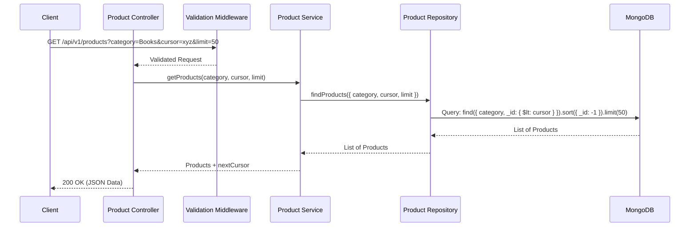

# CodeVector Product API

This repository contains the backend implementation for the CodeVector Internship Take Home Task. It provides a RESTful API to browse a large catalog of products (approximately 200,000), filter them by category, and paginate through them efficiently using cursor-based pagination.

## System Interaction Diagram

The following diagram illustrates the interaction between the client, the API layers, and the database.



## Architecture and Design Decisions

The application strictly adheres to a layered architecture to ensure modularity, scalability, and maintainability.

- **Controllers:** Responsible solely for handling incoming HTTP requests and sending responses. They do not contain business logic.
- **Services:** Encapsulate the core business logic of the application.
- **Repositories:** Abstract the data access layer. All database interactions and connection logic reside here.
- **Models:** Define the data structure and schema for the database (using Mongoose).
- **Validation:** A dedicated layer using Zod to validate incoming request data before it reaches the controller.
- **Middlewares:** Reusable functions for cross-cutting concerns, such as global error handling.

### Cursor-Based Pagination

To meet the requirement of fast pagination that remains consistent even when data changes concurrently, cursor-based pagination was implemented. 

Offset-based pagination (`OFFSET` and `LIMIT` in SQL, or `.skip()` in MongoDB) suffers from performance degradation on large datasets and can result in missing or duplicating items if items are added or removed during browsing. 

Cursor-based pagination solves this by utilizing a unique, sequential identifier. In this implementation, we leverage MongoDB's native `_id` field. Since `_id` inherently contains a timestamp, sorting by `_id` descending guarantees a "newest first" order. The query simply asks for items where `_id` is less than the cursor provided by the client, ensuring perfect consistency and constant time complexity regardless of the page depth.

## Setup and Installation

### Prerequisites

- Node.js (v18 or higher recommended)
- MongoDB instance (local or Atlas)

### Local Development Setup

1. **Install Dependencies**
   Navigate to the backend directory and install the required packages:
   ```bash
   npm install
   ```

2. **Environment Configuration**
   Create a `.env` file in the root of the backend directory. You may configure the port and the MongoDB URI. If not provided, it defaults to `mongodb://localhost:27017/product_api`.
   ```env
   PORT=5000
   MONGO_URI=mongodb://localhost:27017/product_api
   ```

3. **Seeding the Database**
   A script is provided to generate and bulk insert 200,000 products. This ensures the database is populated for testing.
   ```bash
   node scripts/seed.js
   ```

4. **Starting the Server**
   Start the development server using nodemon:
   ```bash
   npm start
   ```
   The server will run on `http://localhost:5000`.

## API Endpoints

### GET `/api/v1/products`

Retrieves a paginated list of products.

**Query Parameters:**
- `category` (optional): Filter products by a specific category (e.g., Electronics, Books).
- `cursor` (optional): The `_id` of the last product from the previous page. Omit this for the first page.
- `limit` (optional): Number of items to return per page. Defaults to 50.

**Response Example:**
```json
{
  "status": "success",
  "data": {
    "products": [
      {
        "_id": "648f5e7f9a1b2c3d4e5f6g7h",
        "name": "Product 1a2b3c4d",
        "category": "Electronics",
        "price": 299.99,
        "unique_id": "123e4567-e89b-12d3-a456-426614174000",
        "created_at": "2023-06-18T10:00:00.000Z",
        "updated_at": "2023-06-18T10:00:00.000Z",
        "__v": 0
      }
    ],
    "nextCursor": "648f5e7f9a1b2c3d4e5f6g7h"
  }
}
```
